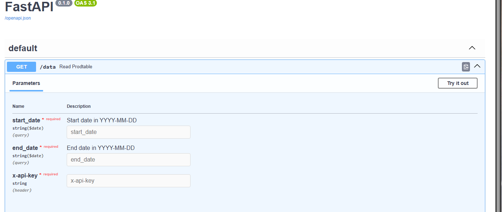

# AzureDEPractice Summary

Practicing building a full End-to-End Pipeline from Data Source to Dashboard

I want to test Azure and its different services. Time limit for this project will be 30 days and the process.

Data will be man made. This will then be put into an undisclosed SFTP server to mimic getting our files from SFTP. From there I will save files in a local folder.

I will then schedule the creation and importation into our SQL Server hosted on Azure through Apache Airflow and eventually try it with Dagster. 

From there, I will create a simple dashboard with KPIs on PowerBI.

## Step-by-Step Procedure

### File Creation

In the file creation folder, I created a script that would create the initial daily data for our dataset. Using the initial data (Hotel Name and Number of Rooms), new daily data would be created by utilizing Airflow.

With these data files, I will then import them into a SFTP to mimic file transfers to clients AND recieving files.

### Creation of the SFTP Server

Due to SFTP File Transfers being a common way to transfer files among Businesses, I will create a SFTP server in Azure.

On Azure, I first created a Storage Account. The most important part when creating this Storage Account is enabling Hirearchical namespace, which allows you to do SFTP File Transfer. Everything else is up to preference based on what you would want.

Once a Storage Account is created, under settings on the left bar, you will click on SFTP and create a local user. This essentially creates a user and password to allow clients and vendors to access the SFTP server. I created two users to mimic vendor and client.

Disclaimer --- Azure charges you hourly for hosting SFTP server. This can cost a lot in the long term, so I just pushed the files into SFTP before deleting the storage account due to fund limits.

### Docker Setup --- Airflow

We created another folder that will hold our Airflow setup. We will utilize Docker to help us set this us. Docker provides us some good advantages when it comes to setting up Airflows such as:

 * Fast Deployment
 * Isolation
 * Compatability

Docker Compose allows us to run a multi-container application, with a variety of services we will utilize in this project. It will also allow users to run the same Airflow setup as we have isolated and defined the versions of the software we are using.

### Airflow --- Pushing files into SFTP Server
With the help of Airflow, I am able to push the initial data file and ochestrate a daily push of daily data into the SFTP server. I utilized Airflow Connections to save my credentials to my SFTP server without hard coding it somewhere. This can most likely be done through Azure Key Vaults as well.

DAGs were created and tested to ensure that they are doing exactly what they should be doing.

### ETL into Database

Since I was able to develop an Airflow Script to create data files and push them into the SFTP Server, I've decided to shut down the SFTP server for two reasons.

1. Retrieving Files off SFTP server will be the same as putting files onto the SFTP. "get" vs "put"
2. Cost of consistently having the SFTP Server on. Azure bills us for the SFTP Server Hourly.

Since I can make these files, I will just skip the "getting the Files" step and directly start the Loading into the Database. 

Regarding Transformations, where we do depends on the end goal of what we want and where the transformation is done. Since my project is a hybrid of cloud and on-premise, doing transformations (computations) would generally be less costly then doing it on the cloud. Doing transformation on the cloud also has its adventages and disadvantages. You can do it before loading into the Database or during a staging table before pushing it into the Production Tables, but cost for computation is something you should always keep mind of, since it can ramp up really quickly.

For this project, I will load the data into a staging table, do transformations (Hotel Metrics: Occ, ADR, RevPAR) before pushing into the Production Table.

### PowerBI Dashboard

You can use any BI Tool to create dashboards. I mainly chose PowerBI to get an understanding and feel for this PowerBI, espeically for my current work. It will be a simple Dashboard, showing daily and summary metrics.

### API Creation

I will also create an API. APIs are one of the most common to for data sharing. Creating one should be super common, espeically when clients want to access data. This will serve as a great practice.

I first developed a development API in the "API" Folder. I was able to create a security, database access, and one endpoint for the API where we are able to query for a date range.

I then decided to host it on AzureWebApps so the internet can access it. This will be turned off soon, so I will relay the steps I took to host it. Directory is extremely important as if your directory is off, it will not download dependencies or look at specific files.

This is the steps I took.

1.  I created the AzureWebApps folder and dumped db.py, main.py, and security.py. I then created requirements.txt and wrote all the dependencies that FastAPI would use. The environment file was not tracked due to it containing sensitive information. 

2. I then created Web App through App Service on Azure. I filled out the necessary information I needed in the Basics Tab and review and created.

3. From there, I accessed the App Service. In Environment Variables, I entered the Environment Variables I had on my .env file (Database Login and API Key).

4. Next in Confirgation, I added this command into Startup Command: "uvicorn main:app --host 0.0.0.0 --port 8000"

5. After that, in Deployment Center, I connected my GitHub since this is where I had the files. Organization, Repository, and Branch information was added. Once save, a .github\workflow will be created in your GitHub Repo. I had to do many changes to the YAML file due to me having my files in the subfolder.

The main changes was these code here, to determine where my dependencies and files are being downloaded to. A lot of errors can happen with this file and the Startup Command.

6. Once you make the changes to the YML file and committ it, The App should immediately start to redeploys. I was able to utilize SwaggerUI to see my API in action. 

### Final Thoughts

This project was very education in learning how to utilize Azure, understanding the industry standards and coding standards, and the different project one can undertake. 

I've learned how to create SFTP Servers, download and push files into SFTP Servers, Creation of API, learning of AirFlow and complex things like Branching, Database creation with ETL, and PowerBI Dashboard Standards.

Azure services will be turned off since I am currently utilizing the free plan on Azure. Feel free to message me if you don't understand thing in the Repository.